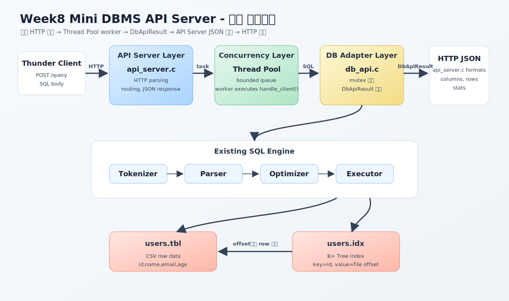
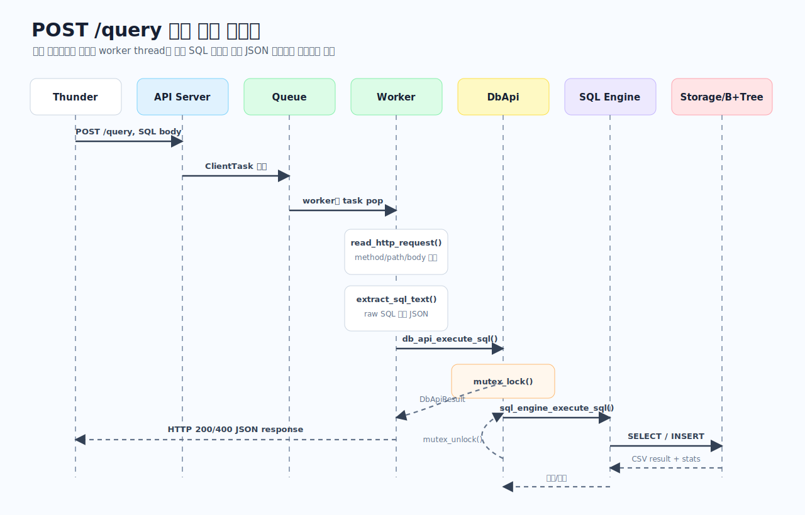
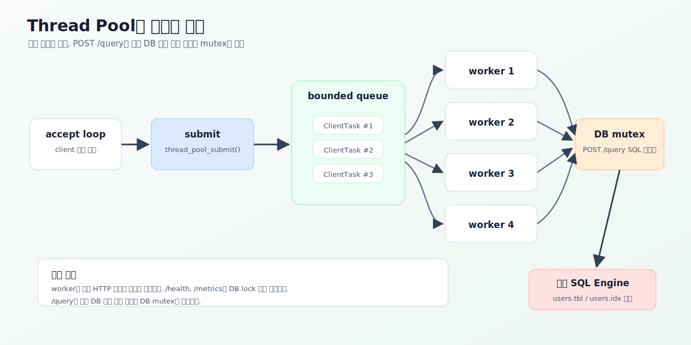
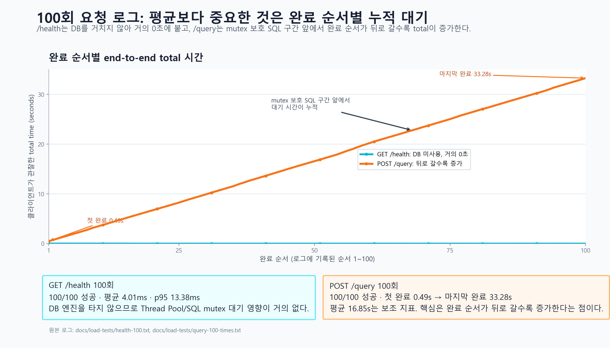
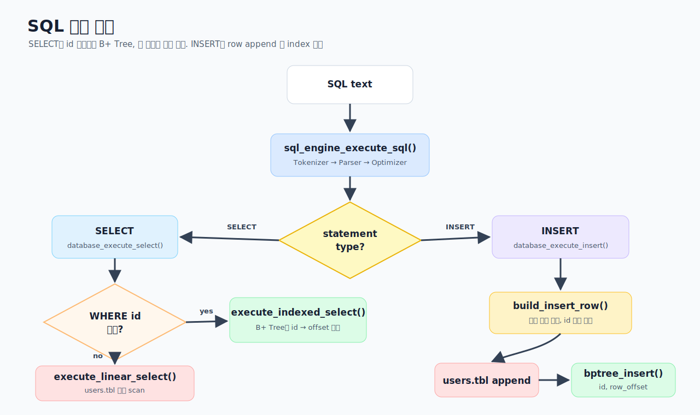
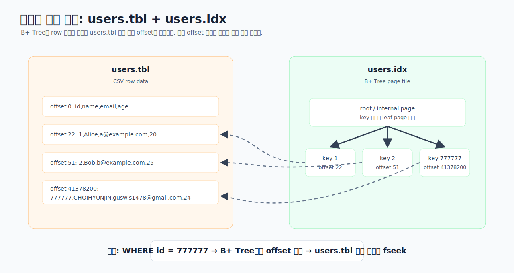

# Week8 Mini DBMS - API Server

외부 클라이언트가 HTTP API로 SQL을 보내면, C 기반 API 서버가 Thread Pool로 요청을 받아 기존 SQL 처리기와 B+ Tree 인덱스를 사용해 결과를 JSON으로 반환하는 미니 DBMS 서버입니다.

발표 한 줄 요약:

> 지난주 SQL 처리기와 B+ Tree 인덱스를 내부 DB 엔진으로 재사용하고, 그 앞에 C 기반 HTTP API 서버와 Thread Pool을 붙여 외부 클라이언트가 SQL을 실행할 수 있게 만들었습니다.

## 4분 발표 흐름

| 시간 | 설명할 내용 | 보여줄 자료 |
|---:|---|---|
| 0:00 - 0:30 | 과제 목표와 우리가 만든 결과물 | 요구사항 대응표 |
| 0:30 - 1:10 | 전체 아키텍처 | 전체 아키텍처 그림 |
| 1:10 - 1:50 | `POST /query` 요청 1개가 처리되는 과정 | 요청 처리 시퀀스 그림 |
| 1:50 - 2:30 | Thread Pool과 동시성 처리 | Thread Pool 그림 |
| 2:30 - 2:50 | 100회 요청 로그로 구조 차이 확인 | `/health` vs `/query` 비교 그림 |
| 2:50 - 3:20 | 기존 SQL 엔진과 B+ Tree 인덱스 재사용 | SQL 실행 분기, 저장 구조 그림 |
| 3:20 - 4:00 | Thunder Client 시연 | `/health`, `/query`, `/metrics` |

## 1. 과제 목표와 구현 결과

이번 주 과제는 **미니 DBMS - API 서버**입니다.

핵심 요구사항은 다음 네 가지입니다.

- 외부 클라이언트가 API로 DBMS 기능을 사용할 수 있어야 합니다.
- Thread Pool을 구성하고 SQL 요청을 병렬 처리해야 합니다.
- 이전 차수 SQL 처리기와 B+ Tree 인덱스를 그대로 활용해야 합니다.
- 구현 언어는 C입니다.

구현 결과:

| 과제 요구사항 | 구현 내용 | 확인 위치 |
|---|---|---|
| API 서버 구현 | C HTTP 서버, `/query`로 SQL 실행 | `src/api/api_server.c` |
| 외부 클라이언트 사용 | Thunder Client에서 SELECT/INSERT 실행 | `POST /query` |
| Thread Pool | worker thread + bounded queue | `src/concurrency/thread_pool.c` |
| 요청마다 worker 처리 | accept된 client 작업을 queue에 넣고 worker가 처리 | `thread_pool_submit()` |
| 기존 SQL 처리기 재사용 | Tokenizer, Parser, Optimizer, Executor 유지 | `src/sql/` |
| B+ Tree 인덱스 재사용 | `id -> row offset` 인덱스 기반 조회 | `src/storage/bptree.c` |
| 동시성 이슈 처리 | worker는 병렬, DB 엔진 실행 구간은 mutex 보호 | `src/api/db_api.c` |

발표 멘트:

```text
API 서버 자체는 새로 만들었지만, SQL을 해석하고 실행하는 내부 엔진은 지난주 코드를 재사용했습니다.
이번 주 핵심은 기존 엔진 앞에 HTTP API 계층과 Thread Pool 계층을 붙인 것입니다.
```

## 2. 전체 아키텍처



설명 순서:

- Thunder Client가 HTTP로 SQL을 보냅니다.
- `api_server.c`가 HTTP 요청을 읽고 `/query` 라우트로 보냅니다.
- Thread Pool의 worker가 요청을 처리합니다.
- `db_api.c`가 기존 SQL 엔진을 호출합니다.
- SQL 엔진은 `Tokenizer -> Parser -> Optimizer -> Executor` 흐름을 그대로 사용합니다.
- Storage 계층은 `users.tbl`과 `users.idx`를 사용합니다.
- 엔진 출력은 다시 `db_api.c`에서 `DbApiResult`로 정리됩니다.
- 최종 JSON 포맷과 HTTP 응답은 `api_server.c`가 담당합니다.

비판적으로 봐야 할 점:

- `db_api.c`가 JSON을 직접 만드는 것은 아닙니다. `db_api.c`는 `DbApiResult`를 반환하고, JSON 포맷은 `api_server.c`가 담당합니다.
- Thread Pool은 요청을 병렬로 받지만, 기존 DB 엔진 자체는 mutex로 보호됩니다.

## 3. 요청 처리 시퀀스



`POST /query` 하나를 기준으로 보면 다음 순서입니다.

1. Thunder Client가 SQL body를 전송합니다.
2. API 서버가 연결을 accept하고 `ClientTask`를 queue에 넣습니다.
3. worker thread가 task를 꺼냅니다.
4. worker가 HTTP method, path, body를 읽습니다.
5. body에서 SQL 문자열을 추출합니다.
6. `db_api_execute_sql()`이 기존 SQL 엔진을 호출합니다.
7. DB 실행 구간은 mutex로 보호됩니다.
8. 엔진 출력은 `FILE*`에서 문자열로 캡처됩니다.
9. API 서버가 JSON body를 만들어 응답합니다.

발표 멘트:

```text
HTTP 요청 처리와 JSON 응답 생성은 worker별로 병렬 처리됩니다.
다만 기존 엔진이 공유 파일과 B+ Tree 인덱스를 사용하므로, 실제 SQL 실행 구간만 mutex로 감쌌습니다.
```

## 4. Thread Pool과 동시성 설계



핵심 판단:

- 요청마다 새 thread를 만들지 않고, 미리 만든 worker thread를 재사용합니다.
- accept loop는 연결을 받는 역할만 합니다.
- 실제 요청 처리는 worker thread가 수행합니다.
- `/health`, `/metrics`는 DB lock 없이 응답합니다.
- `/query`만 기존 DB 엔진 접근 구간에서 mutex를 탑니다.

왜 mutex를 썼는가:

- 기존 SQL 엔진은 thread-safe하게 작성된 구조가 아닙니다.
- `users.tbl`과 `users.idx`를 여러 thread가 동시에 건드리면 파일 offset, B+ Tree 상태가 꼬일 수 있습니다.
- 그래서 API 요청 접수는 병렬로 처리하되, SQL 실행 구간은 정합성을 위해 직렬화했습니다.

방어 포인트:

```text
완전한 병렬 DB 엔진은 아닙니다.
이번 구현은 API 서버와 요청 처리 구조는 병렬화했고,
기존 DB 엔진의 공유 상태는 mutex로 보호한 구조입니다.
```

## 5. 100회 요청 로그로 본 구조 차이



로그 해석:

- 여기서 평균은 보조 지표이고, 핵심은 **완료 순서별 total time 추세**입니다.
- `GET /health` 100회는 모두 200으로 성공했고, DB 엔진을 거치지 않기 때문에 그래프가 거의 0초 근처에 붙어 있습니다.
- `POST /query` 100회도 모두 200으로 성공했지만, 뒤쪽 요청으로 갈수록 end-to-end total 시간이 점점 커집니다.
- 실제 로그 기준으로 `/query`는 첫 완료가 약 0.49초, 마지막 완료가 약 33.28초입니다.
- 이유는 worker가 요청을 병렬로 받아도 기존 SQL 엔진 실행 구간은 mutex로 보호되어 한 번에 하나씩만 들어갈 수 있기 때문입니다.
- 따라서 이 결과는 “Thread Pool은 요청을 병렬로 받지만, 기존 DB 엔진 접근은 정합성을 위해 직렬화되고 대기 시간이 누적된다”는 구조를 보여줍니다.
- 원본 로그는 `docs/load-tests/health-100.txt`, `docs/load-tests/query-100-times.txt`에 보관했습니다.
- 그래프는 `python -m pip install -r requirements-dev.txt` 후 `python tools/plot_load_tests.py`로 원본 로그에서 다시 만들 수 있습니다.

주의해서 말할 점:

```text
이 그래프는 단일 SQL 1개의 순수 실행 시간이 아니라,
100회 요청을 보냈을 때 클라이언트가 관찰한 end-to-end total 시간입니다.
따라서 query 쪽 시간이 길어진 핵심 이유는 SQL 실행 자체뿐 아니라,
mutex로 보호된 기존 엔진 구간 앞에서 대기 시간이 누적되기 때문입니다.
```

## 6. 기존 SQL 엔진과 B+ Tree 재사용



SELECT 분기:

- `WHERE id ...` 조건이면 B+ Tree 인덱스를 사용합니다.
- `WHERE name ...`, `WHERE email ...`, `WHERE age ...` 같은 non-id 조건은 선형 탐색합니다.

INSERT 분기:

- 들어온 값을 테이블 컬럼 순서에 맞게 정렬합니다.
- id가 없으면 자동 부여합니다.
- `users.tbl` 끝에 row를 append합니다.
- 새 id와 row offset을 B+ Tree에 추가합니다.

## 7. 데이터 저장 구조



핵심:

- row 데이터는 `users.tbl`에 저장됩니다.
- B+ Tree 인덱스는 `users.idx`에 저장됩니다.
- 인덱스 value는 row 자체가 아니라 `users.tbl` 안의 파일 offset입니다.
- `WHERE id = ?` 조회는 B+ Tree에서 offset을 찾고, 해당 위치로 `fseek`해서 row를 읽습니다.
- 그림의 offset 숫자는 이해를 돕기 위한 예시입니다.

발표 멘트:

```text
B+ Tree가 row 전체를 들고 있는 것이 아니라, row가 파일의 몇 번째 byte 위치에 있는지를 들고 있습니다.
그래서 id 조건 조회는 전체 파일을 스캔하지 않고 해당 offset으로 바로 이동할 수 있습니다.
```

## 8. 시연 순서

### 8.1 서버 실행

VS Code 터미널에서 프로젝트 폴더를 엽니다.

```powershell
cd "C:\Users\cedis\Downloads\idea(backjoon)\week8\mini_dbms_api_server"
```

빌드:

```powershell
powershell -ExecutionPolicy Bypass -File .\build.ps1
```

서버 실행:

```powershell
.\mini_sql_server.exe --data-dir runtime_data --host 127.0.0.1 --port 8080 --threads 4
```

### 8.2 Thunder Client 요청

1. 서버 상태 확인

```text
GET http://127.0.0.1:8080/health
```

기대 결과:

```json
{"ok":true,"status":"ready"}
```

2. B+ Tree 인덱스 조회

```text
POST http://127.0.0.1:8080/query
```

Body:

```sql
SELECT * FROM users WHERE id = 777777;
```

확인할 것:

- `rows`에 실제 사용자 데이터가 보입니다.
- `stats.usedIndex`가 `true`입니다.
- `stats.scannedRows`가 작게 나옵니다.

3. INSERT

```sql
INSERT INTO users (name, email, age) VALUES ('TEAM6_API_USER', 'team6-api-user@example.com', 26);
```

4. 방금 넣은 row 조회

```sql
SELECT * FROM users WHERE email = 'team6-api-user@example.com';
```

확인할 것:

- non-id 조건이므로 `usedIndex`는 `false`입니다.
- 그래도 API 서버를 통해 DBMS 기능이 정상 동작합니다.

5. 요청 통계 확인

```text
GET http://127.0.0.1:8080/metrics
```

## 9. API 응답 예시

```json
{
  "ok": true,
  "result": "id,name,email,age\n777777,CHOIHYUNJIN,guswls1478@gmail.com,24\n",
  "columns": ["id", "name", "email", "age"],
  "rows": [
    {
      "id": "777777",
      "name": "CHOIHYUNJIN",
      "email": "guswls1478@gmail.com",
      "age": "24"
    }
  ],
  "rowCount": 1,
  "stats": {
    "usedIndex": true,
    "scannedRows": 1,
    "matchedRows": 1,
    "elapsedMs": 1.223
  }
}
```

응답에서 볼 포인트:

- `result`: 기존 엔진의 CSV 출력 원문입니다.
- `columns`, `rows`, `rowCount`: Thunder Client에서 보기 좋게 추가한 JSON 구조입니다.
- `stats`: 인덱스 사용 여부와 조회 row 수를 보여줍니다.

## 10. MacBook / Docker 실행

MacBook에서는 Docker 실행을 권장합니다. Windows와 macOS의 C 컴파일러 차이를 줄이고 같은 Linux 환경에서 시연할 수 있습니다.

```bash
docker build -t mini-sql-bptree .
docker run --rm -it -p 8080:8080 -v "$(pwd)/runtime_data:/app/runtime_data" mini-sql-bptree ./mini_sql_server --data-dir /app/runtime_data --host 0.0.0.0 --port 8080 --threads 4
```

Thunder Client에서는 동일하게 호출합니다.

```text
http://127.0.0.1:8080/query
```

## 11. 파일 구조

```text
src/
├── api/
│   ├── api_server.c      # HTTP 서버, routing, JSON 응답
│   └── db_api.c          # API 서버와 기존 SQL 엔진 연결
├── apps/
│   ├── server_main.c     # API 서버 실행 진입점
│   ├── main.c            # CLI SQL 실행
│   ├── test_main.c       # 단위 테스트 실행
│   ├── benchmark_main.c
│   └── seed_main.c
├── concurrency/
│   └── thread_pool.c     # worker thread, queue, condition variable
├── sql/
│   ├── tokenizer.c
│   ├── parser.c
│   ├── optimizer.c
│   ├── executor.c
│   └── engine.c
├── storage/
│   ├── database.c        # SELECT/INSERT, table file, index 연결
│   ├── bptree.c          # B+ Tree index
│   └── storage.c
└── common/
    ├── util.c
    └── trace.c
```

자세한 함수별 설명과 줄 번호는 `CODE_REVIEW_GUIDE.md`에 정리되어 있습니다.

## 12. 테스트

Windows:

```powershell
powershell -ExecutionPolicy Bypass -File .\build.ps1
.\mini_sql_tests.exe
.\mini_sql_api_tests.exe
```

Docker:

```bash
docker build -t mini-sql-bptree .
docker run --rm mini-sql-bptree ./mini_sql_tests
docker run --rm mini-sql-bptree ./mini_sql_api_tests
```

검증 내용:

- SQL 처리기 기본 동작
- B+ Tree insert/search/range
- API용 DB adapter 결과 캡처
- Thread Pool queue 처리
- stale index 감지 후 재생성
- `POST /query` 응답 JSON 구조

## 발표 마무리 문장

```text
이번 구현은 새 DBMS를 다시 만든 것이 아니라,
지난주 SQL 처리기와 B+ Tree 인덱스를 내부 엔진으로 재사용하고,
그 앞에 C 기반 HTTP API 서버와 Thread Pool을 붙여 외부 클라이언트가 사용할 수 있게 만든 것입니다.
동시성은 Thread Pool로 요청을 병렬 처리하되,
기존 엔진의 공유 파일과 인덱스 접근은 mutex로 보호해 정합성을 우선했습니다.
```
